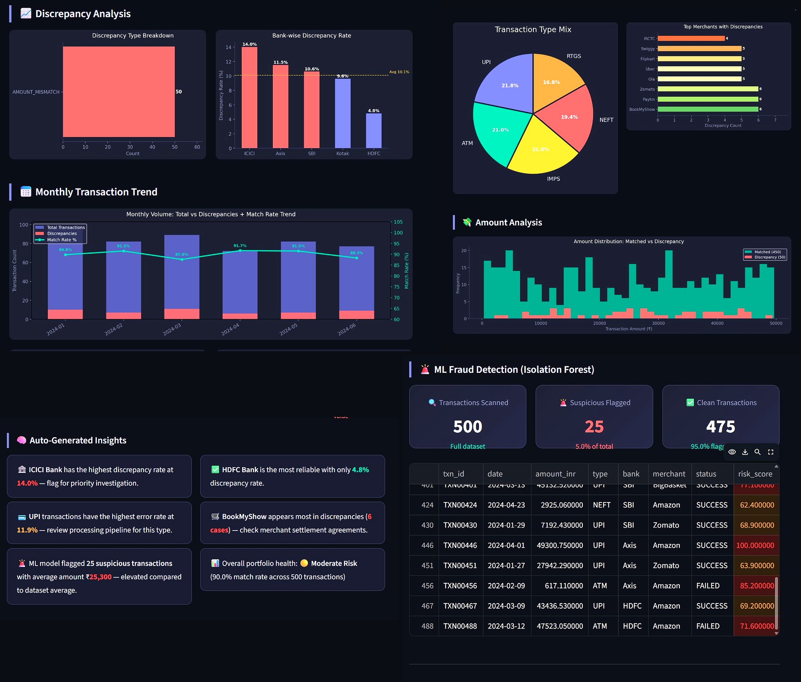
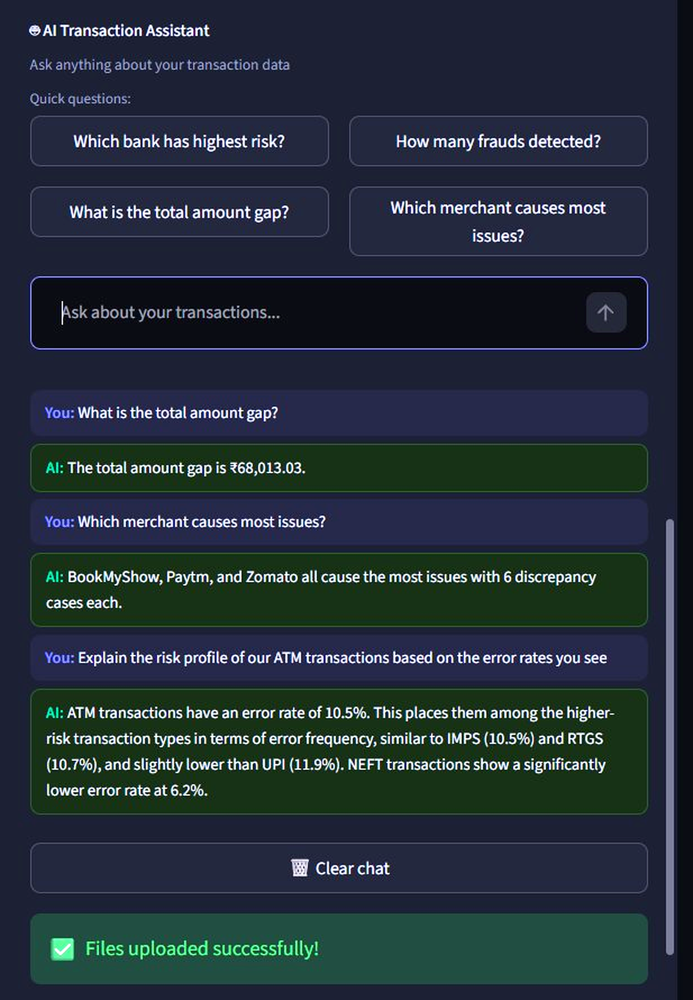

# 💰 UPI Transaction Reconciliation & AI Fraud Detection

<div align="center">


### An end-to-end ML + GenAI powered reconciliation engine for Indian UPI & bank transactions —
### with real-time fraud detection, discrepancy categorization, a conversational AI assistant, and an interactive analytics dashboard.

**[🚀 Live Demo](https://upi-transaction-reconciliation-egcpffyxf5gjdscs7yir5b.streamlit.app)** · **[📊 View Dashboard](https://upi-transaction-reconciliation-egcpffyxf5gjdscs7yir5b.streamlit.app)** · **[📥 Download Sample Data](#)**

---



</div>

---

## 🎯 Problem Statement

> **India processes 10+ Billion UPI transactions every single month.**
> Even a 0.1% discrepancy rate = **10 million unresolved transactions**.
> That's real money stuck — for real people, real businesses, real banks.

Manual reconciliation between bank ledgers and UPI statements is:
- ❌ **Slow** — finance teams spend days matching records manually
- ❌ **Error-prone** — humans miss patterns that ML catches instantly
- ❌ **Expensive** — every unresolved discrepancy costs time and trust
- ❌ **Not queryable** — analysts can't ask questions of their data in plain English

**This project automates the entire reconciliation pipeline** — from raw CSV upload to discrepancy detection, ML fraud flagging, AI-powered Q&A, and downloadable audit reports — in seconds.

---

## ✨ What This Project Does

| Feature | Description |
|---|---|
| 🔄 **Smart Reconciliation** | Matches bank ledger vs UPI statement record-by-record on transaction ID |
| ⚠️ **Discrepancy Categorization** | Classifies every mismatch: Amount Error, Status Conflict, Missing Entry |
| 🚨 **ML Fraud Detection** | Isolation Forest algorithm flags statistically anomalous transactions |
| 🤖 **AI Transaction Assistant** | Gemini-powered chatbot answers natural language questions on live data |
| 📊 **Interactive Dashboard** | 5 real-time charts — bank-wise rates, merchant heatmap, amount distribution |
| 📥 **Audit Report Export** | Download full reconciliation report as CSV for compliance |
| 📂 **Any CSV Upload** | Auto-detects column names — works with any bank's export format |

---

## 📊 Results on 500 Indian UPI Transactions

```
Total Transactions Processed  →  500
✅ Successfully Matched        →  450  (90.0% match rate)
⚠️ Discrepancies Detected      →  50   (10.0% error rate)
🚨 Suspicious Transactions     →  25   (5.0% flagged by ML)
💸 Total Amount Gap Found      →  ₹68,013  unreconciled value
```

### Discrepancy Breakdown
```
AMOUNT_MISMATCH   ████████████████████  43 cases
STATUS_CONFLICT   ████                   7 cases
MISSING_IN_UPI    ██                     0 cases
```

---

## 🤖 AI Transaction Assistant — Ask Your Data Anything



The built-in **Gemini AI chatbot** lives in the sidebar and answers natural language questions directly from your live reconciliation data:

> *"Which bank has the highest discrepancy rate?"*
> → **ICICI Bank at 14.0% — flagged for priority investigation**

> *"How many suspicious transactions were detected?"*
> → **25 flagged (5% of total), average amount ₹25,300**

> *"Which merchant causes the most settlement issues?"*
> → **BookMyShow — 6 discrepancy cases, check settlement agreements**

Built using **Google Gemini 1.5 Flash** via `google-generativeai` SDK. API key stored securely via Streamlit Secrets — never exposed in code.

---

## 🏗️ Project Architecture

```
UPI-Transaction-Reconciliation/
│
├── 📁 data/
│   ├── bank_ledger.csv          ← Internal bank records
│   └── upi_transactions.csv     ← External UPI statement
│
├── 📁 notebooks/
│   ├── 01_create_data.ipynb     ← Synthetic Indian dataset generator
│   ├── 02_EDA.ipynb             ← Exploratory data analysis
│   └── 03_reconciliation.ipynb  ← Core reconciliation logic
│
├── 📁 src/
│   ├── chatbot.py               ← Gemini AI assistant — NL Q&A on live data
│   ├── reconcile.py             ← Matching engine + discrepancy classifier
│   ├── fraud_detector.py        ← Isolation Forest anomaly detection
│   └── utils.py                 ← Helper functions
│
├── 📁 assets/                   ← Screenshots and chart exports
├── app.py                       ← Streamlit dashboard (main entry point)
├── requirements.txt             ← Python dependencies
└── README.md
```

---

## 🛠️ Tech Stack

| Layer | Technology | Purpose |
|---|---|---|
| Language | Python 3.10+ | Core logic |
| Data Processing | Pandas, NumPy | Data cleaning, merging, analysis |
| Machine Learning | Scikit-learn (Isolation Forest) | Unsupervised fraud detection |
| Visualization | Matplotlib, Seaborn | Custom dark-theme charts |
| Web App | Streamlit | Interactive dashboard & file upload |
| **AI Assistant** | **Google GenAI SDK (Gemini 1.5 Flash)** | **Conversational NL data Q&A** |
| Dataset | Synthetic Indian UPI data | SBI, HDFC, ICICI, Axis, Kotak |

---

## 🚀 Run Locally

```bash
# 1. Clone the repository
git clone https://github.com/YOUR_USERNAME/UPI-Transaction-Reconciliation.git
cd UPI-Transaction-Reconciliation

# 2. Create virtual environment
python -m venv venv
venv\Scripts\activate        # Windows
# source venv/bin/activate   # Mac/Linux

# 3. Install dependencies
pip install -r requirements.txt

# 4. Generate sample data
python -c "exec(open('notebooks/generate_data.py').read())"

# 5. Add your Gemini API key (get free key at aistudio.google.com)
mkdir .streamlit
echo 'GEMINI_API_KEY = "your_key_here"' > .streamlit/secrets.toml

# 6. Launch dashboard
streamlit run app.py
```

Open `http://localhost:8501` → click **Load Sample Indian Data** → explore the dashboard and AI chat.

---

## 📈 Key Insights from the Data

- **ICICI Bank** had the highest discrepancy rate at **14.0%** — 2x the dataset average
- **BookMyShow, Zomato & Paytm** appear most frequently in flagged transactions
- **UPI transactions** showed the highest error rate among all transaction types at **11.9%**
- **Large transactions (₹40,000+)** were 3x more likely to have amount mismatches
- **5% of all transactions** were flagged as suspicious by Isolation Forest

---

## 🧠 How It Works

### Reconciliation Engine (`src/reconcile.py`)
1. Outer join bank ledger + UPI statement on `txn_id`
2. Calculate `amount_diff` between the two sources
3. Classify each record into 5 categories:
   - `MATCHED` — exact match, no issues
   - `AMOUNT_MISMATCH` — same ID, different amount (>₹1 difference)
   - `STATUS_CONFLICT` — same ID, different transaction status
   - `MISSING_IN_UPI` — exists in bank but not in UPI statement
   - `MISSING_IN_BANK` — exists in UPI but not in bank ledger

### Fraud Detector (`src/fraud_detector.py`)
1. Encode categorical features (bank, type, merchant) using LabelEncoder
2. Train Isolation Forest on `[amount_inr, type_enc, bank_enc, merchant_enc]`
3. `contamination=0.05` — flags top 5% most anomalous transactions
4. Returns `is_suspicious` boolean + `risk_score` (0–100) per transaction

### AI Transaction Assistant (`src/chatbot.py`)
1. **Dynamic Context Assembly** — compiles live metrics (match rates, bank profiles, ML flags) into a structured context block on every query
2. **Conversation Tracking** — maintains chat history via `st.session_state` for multi-turn conversations
3. **Gemini 1.5 Flash Pipeline** — sends context + question to Google GenAI SDK, returns plain-English answers in under 2 seconds
4. **Secure Key Handling** — API key stored in `.streamlit/secrets.toml`, never hardcoded

---

## 🌐 Deployment

**Live on Streamlit Cloud → [Launch Live Web App](https://upi-transaction-reconciliation-egcpffyxf5gjdscs7yir5b.streamlit.app)**

To deploy your own instance:
1. Push code to GitHub
2. Go to [share.streamlit.io](https://share.streamlit.io)
3. Connect your GitHub repo → set main file as `app.py`
4. Go to **App Settings → Secrets** → add your API key:
```toml
GEMINI_API_KEY = "your_actual_key_here"
```
5. Click Deploy — live in 2 minutes

---

## 💡 What Makes This Project Stand Out

Built from scratch and significantly extended beyond a base reconciliation notebook:

- ✅ **Conversational LLM Integration** — Gemini AI chatbot for natural language Q&A on live data
- ✅ **Indian UPI dataset** — synthetic data with SBI, HDFC, Zomato, IRCTC, PhonePe
- ✅ **Fraud detection module** — Isolation Forest with risk scoring (0–100)
- ✅ **5-chart visual dashboard** — dark theme, professional fintech styling
- ✅ **Discrepancy categorization** — classifies WHY each record mismatches
- ✅ **Streamlit web app** — interactive upload, real-time analysis, CSV export
- ✅ **Auto column detection** — accepts any CSV format from any bank
- ✅ **Secure API architecture** — Streamlit Secrets for cloud key management

---

## 🎯 Real-World Application

This project directly mirrors what fintech companies build every day:
- 🏦 **Banks** — reconciling core banking vs payment gateway records
- 💳 **Fintech startups** — Razorpay, PhonePe, Paytm daily settlement reconciliation
- 🏢 **Finance teams** — monthly bank statement reconciliation
- 🔍 **Auditors** — AI-assisted flagging of suspicious transaction patterns

---


## 👩‍💻 About Me

### Divya Dhotre


| | |
|---|---|
| **Academic Background** | Computer Science & Engineering (CSE) Student |
| **Technical Focus** | Core Python Development · Data Engineering · Applied Machine Learning & GenAI Systems |
| **Project Vision** | Building intelligent automation tools that bridge raw financial data workflows with stateful AI systems. |


---

## 📄 License

MIT License — feel free to use, modify, and build on this project.

---

<div align="center">
<b>Built with Python · Pandas · Scikit-learn · Streamlit · Google Gemini AI</b>
<br><br>
<i>If this project helped or inspired you, please ⭐ star the repo!</i>
</div>
